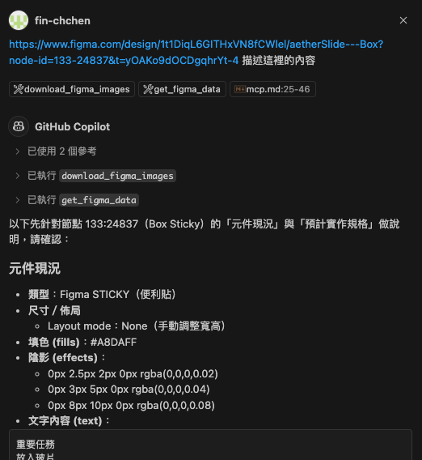
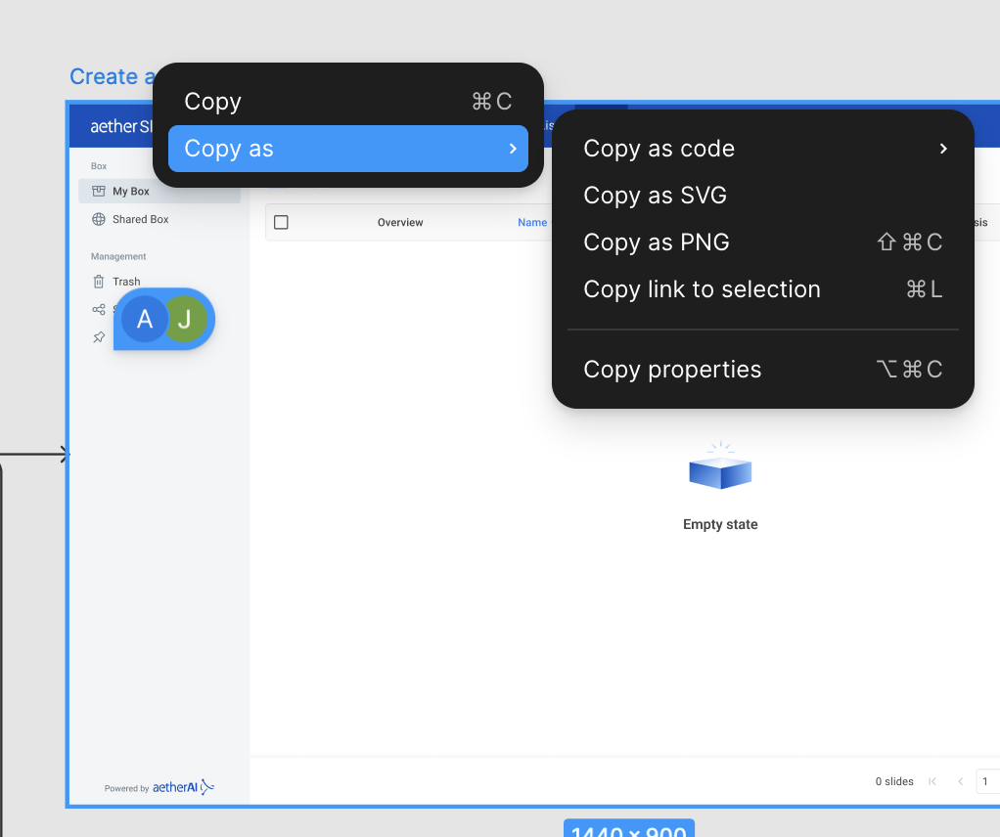
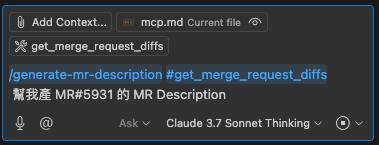
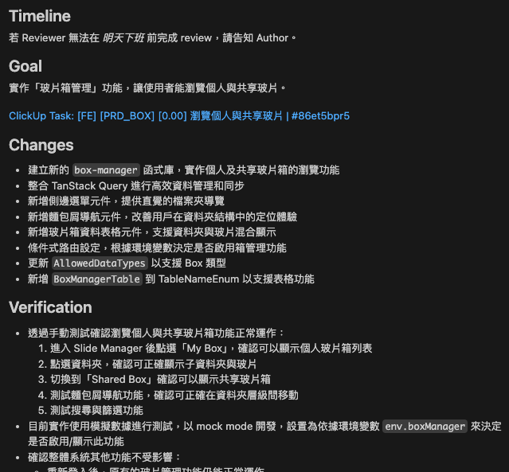

# VSCode MCP 設定指南

## 設定 MCP

目前有兩個 MCP

- figma mcp: 用來取 figma 資源
- gitlab mcp: 用來寫 MR Description / Code Review

檔案在 `frontend/.vscode/mcp.example.json` ，需把內容複製到 `frontend/.vscode/mcp.json` 內。以下是內容解說

```json
{
  "inputs": [
    {
      // 第一次使用時會跳出輸入 Figma API Key 的提示並存成環境變數
      "type": "promptString",
      "id": "figma-key",
      "description": "Figma API Key",
      "password": false
    },
    {
      // 第一次使用時會跳出輸入 GitLab Personal Access Token 的提示並存成環境變數
      "type": "promptString",
      "id": "gitlab-personal-token",
      "description": "GitLab Personal Access Token",
      "password": false
    }
  ],
  "servers": {
    // MCP Server 設定
    "Figma": {
      "command": "npx",
      "args": ["-y", "figma-developer-mcp", "--stdio"],
      "env": {
        "FIGMA_API_KEY": "${input:figma-key}" // 使用先前儲存的 GitLab Figma API Key 環境變數
      }
    },
    "GitLab communication server": {
      "command": "npx",
      "args": ["-y", "@zereight/mcp-gitlab"],
      "env": {
        "GITLAB_PERSONAL_ACCESS_TOKEN": "${input:gitlab-personal-token}", // 使用先前儲存的 GitLab Personal Access Token 環境變數
        "GITLAB_API_URL": "https://gitlab.com/api/v4",
        "GITLAB_READ_ONLY_MODE": "true",
        "USE_GITLAB_WIKI": "true"
      }
    }
  }
}
```

## Figma MCP

### 1. 產生 Figma Personal Access Token

1. 登入 Figma，點擊右上角大頭貼 → **Settings**
2. 左側選單點 **Developer settings** → **Personal access tokens**
3. 點擊 **Create new personal token**，命名後複製產生的 Token

### 2. 取得 Figma Link

- 開啟 Figma
- 選擇需要討論的 UI
- 右鍵選擇 Copy as -> Copy link to selection
- 到 copilot 內貼上

### 3. 在 VSCode Copilot 中使用 MCP

- 任一模式 (chat / edit / agent) 下，在 chat 對話框輸入 `#get_figma_data` 以及 `#download_figma_images` ，即會觸發 figma mcp。
- prompt 內附上相關的 figma ui link
- 送出後系統會自動透過 MCP 取得 figma 資訊



### 注意事項

- 確認伺服器狀態： `Cmd + Shift + P` 輸入 MCP: List Servers 應該會看到 Figma 以及此 MCP 當前狀態
- 第一次啟動 Figma MCP 時會提示輸入並安全儲存 Token



## GitLab MCP

### 初始設定

- 產生 GitLab Personal Access Token <https://docs.gitlab.com/user/profile/personal_access_tokens/>
- 參照 [Copilot Instruction and Custom Prompts](./instruction-and-prompts.md) 設定好 prompt files

### 產生 MR Description

- 任一模式 (chat / edit / agent) 下，在 chat 對話框輸入 `/generate-mr-description` 以及 `#get_merge_request_diffs` 並且在 prompt 內提到你要產 MR Description 的 MR id 如 `5931` ，或是直接貼上 MR url 如 `https://gitlab.com/DYSK_Labs/website/-/merge_requests/5931`
- 可以的話提供 規格文件、 prd 或是 clickup url ，會讓產出的 MR Description 更接近需求面

#### 輸入範例



#### LLM 產出


